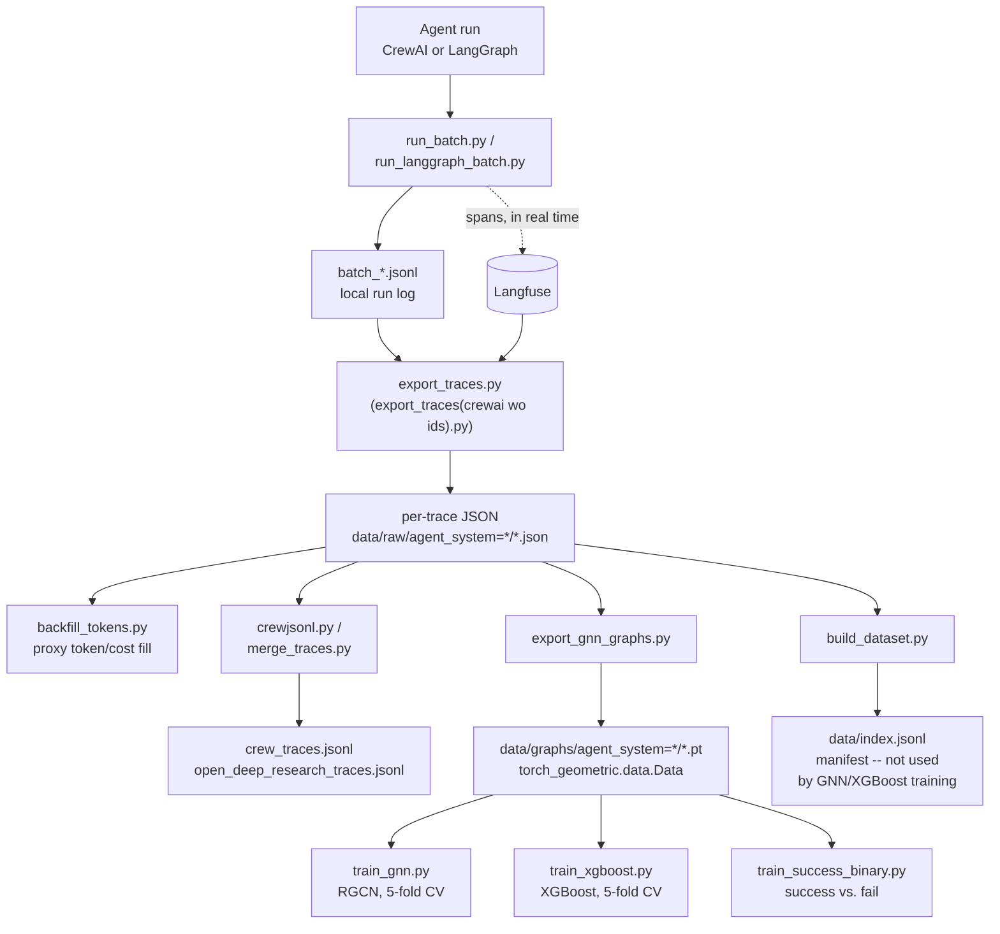

# Agentic Pipeline Benchmarking — Graph-Based Bottleneck Detection

**A pipeline that runs multi-agent AI systems, captures their execution traces as graphs, and trains GNNs to detect failure modes (loops, timeouts, retrieval failures, hallucinations) from trace structure alone.**

[](https://python.org)
[](https://crewai.com)
[](https://langchain-ai.github.io/langgraph/)
[](https://pyg.org)
[](https://langfuse.com)

---

Two independent agent systems (a **CrewAI** crew and a custom **LangGraph** deep-research agent) run benchmark tasks with optional synthetic failure injection. Every run is traced span-by-span through Langfuse, exported into a shared JSON schema, converted into `torch_geometric` graphs, and used to train an RGCN and an XGBoost baseline that classify each trace as clean or as one of several failure motifs (loop, timeout, retrieval failure, hallucination).

This README describes what is **actually implemented and runnable in this repo today** — not a project plan. See [`project_progress.md`](project_progress.md) for the team's own status tracking and [`steps_to_execute.md`](steps_to_execute.md) for the exact commands used to generate the current dataset.

---

## Table of Contents

- [Status at a Glance](#status-at-a-glance)
- [Pipeline Overview](#pipeline-overview)
- [Repository Layout](#repository-layout)
- [Agent Systems](#agent-systems)
- [Failure Injection](#failure-injection)
- [Running the Agents](#running-the-agents)
- [Trace Export → Dataset → Graphs](#trace-export--dataset--graphs)
- [Model Training](#model-training)
- [Current Dataset](#current-dataset)
- [Configuration](#configuration)
- [Known Gaps and Rough Edges](#known-gaps-and-rough-edges)

---

## Status at a Glance

| Component | State |
| --- | --- |
| CrewAI agent (researcher + writer, tool use, guardrails, retries) | Done — `agents/crewai_agent.py` |
| Custom LangGraph deep-research agent (planner → dynamic researchers → merger → writer) | Done — `agents/open_deep_research_agent.py` |
| Offline zero-cost mode (no LLM, no network) | Done — `agents/offline.py` |
| Failure injection (loop, timeout, retrieval_fail, hallucination, context_overflow) | Done for both agent systems |
| Langfuse span tracing | Done for both agent systems |
| Batch runners + FastAPI wrappers | Done — `run_batch.py` / `app.py` (CrewAI), `run_langgraph_batch.py` / `run_langgraph_app.py` (LangGraph) |
| Trace export from Langfuse → schema JSON | Done — `export_traces(crewai wo ids).py` |
| Token/cost backfill for pre-fix traces | Done — `backfill_tokens.py` |
| Dataset indexing (`build_dataset.py`) | Implemented, but its output (`data/index.jsonl`) is **not** what feeds GNN training — see note below |
| JSONL merge scripts (`crewjsonl.py`, `merge_traces.py`) | Done, ad hoc one-off scripts |
| Graph construction (`export_gnn_graphs.py`) | Done — produces `.pt` files per trace |
| GNN training (RGCN, 5-fold CV) | Done — `train_gnn.py` |
| XGBoost baseline (5-fold CV) | Done — `train_xgboost.py` |
| Binary success/fail classifier | Done — `train_success_binary.py` (reuses graphs, no re-export needed) |
| FinRobot agent system | **Not started** — referenced in comments as future work, no code exists |
| GAT / HeteroGAT variants mentioned in `project_progress.md` | **Not implemented** — only the RGCN in `train_gnn.py` exists |
| Random Forest baseline | **Not implemented** — only XGBoost |

---

## Pipeline Overview



**Two datasets exist in parallel and are not the same thing:**
- `data/raw/agent_system=*/*.json` → `export_gnn_graphs.py` → `data/graphs/` is what `train_gnn.py`, `train_xgboost.py`, and `train_success_binary.py` actually consume.
- `build_dataset.py` → `data/index.jsonl` computes global percentile-based `slow`/`expensive` labels as a manifest, but per `project_progress.md`, this file is **not** wired into the GNN/XGBoost training path.

---

## Repository Layout

```
agents/
  base.py                     AgentSystem ABC, FailureInjectionConfig, RunResult
  schemas.py                  Pydantic contracts: ResearchFindings, FinalAnswer
  tools.py                    calculator, web_search (DuckDuckGo), local_knowledge
  evaluation.py                guardrails (in-loop) + run_labels heuristics (post-hoc)
  offline.py                  zero-cost, zero-network deterministic mode
  crewai_agent.py              CrewAI system: Researcher + Writer, guardrails, retries
  open_deep_research_agent.py  Custom LangGraph system: Planner -> Send-spawned
                                researchers -> Merger -> Writer
  __init__.py                  REGISTRY = {"crewai": CrewAIAgent}
telemetry/
  instrument.py                Langfuse + OpenInference instrumentation for CrewAI
app.py                         FastAPI: POST /run?system=crewai (port 8000)
run_batch.py                    CLI batch runner for CrewAI
run_langgraph_app.py            FastAPI for the LangGraph agent (port 8001)
run_langgraph_batch.py          CLI batch runner for the LangGraph agent
"export_traces(crewai wo ids).py"  Langfuse -> schema JSON exporter
backfill_tokens.py               proxy token/cost backfill for pre-fix traces
build_dataset.py                 raw JSON -> data/index.jsonl manifest (see note above)
crewjsonl.py / merge_traces.py    ad hoc JSONL merge/shuffle scripts
export_gnn_graphs.py             trace JSON -> torch_geometric .pt graphs
train_common.py                  shared graph loading / label remapping / featurization
train_gnn.py                     RGCN training, stratified 5-fold CV
train_xgboost.py                 XGBoost training, stratified 5-fold CV
train_success_binary.py          binary success/fail classifier (GNN or XGBoost)
data/
  raw/agent_system=crewai/       91 exported CrewAI traces (JSON)
  graphs/agent_system=crewai/    91 graphs (.pt)
  graphs/agent_system=open_deep_research/   48 graphs (.pt)
  dataset_stats/crewai.md        summary stats for the CrewAI trace set
  index/                         build_dataset.py output location (empty by default)
crew_traces.jsonl, open_deep_research_traces.jsonl   merged per-system JSONL exports
logs/                            batch run logs from dataset generation
project_progress.md              team's own status writeup
steps_to_execute.md              exact commands used to build the current dataset
Dockerfile, docker-compose.yml   containerized app (CrewAI system only)
requirements.txt
.env.example
```

---

## Agent Systems

### 1. CrewAI system (`agents/crewai_agent.py`)

A two-agent sequential pipeline:

1. **Researcher** — has three tools (`local_knowledge`, `web_search`, `calculator`), produces `ResearchFindings` via `output_pydantic`, validated by a guardrail that re-prompts on empty facts or out-of-range confidence.
2. **Writer** — synthesizes the research context (no tools) into `FinalAnswer`, guardrail-validated for minimum content length.

Two retry layers: guardrail retries (malformed/insufficient output, in-loop) and a `tenacity`-wrapped `crew.kickoff()` retry (transient infra failures only).

Runs in one of three LLM modes, auto-detected from `.env`:

| Mode | Cost | What it needs |
| --- | --- | --- |
| `offline` (default) | $0, no network | nothing — deterministic answers from the local knowledge base |
| `ollama` | $0, local | Ollama installed + a pulled model (`ollama pull llama3.2:3b`) |
| `cloud` | free-tier/paid | an OpenAI-compatible API key (e.g. Groq) |

### 2. Custom LangGraph deep-research agent (`agents/open_deep_research_agent.py`)

A tree-structured LangGraph workflow using the **dynamic `Send` API** — branch width is decided by the planner LLM itself (1–2 subtopics for narrow tasks, 3–5 for broad/comparative ones), not hardcoded:

```
PLANNER --Send--> researcher[0] --+
                  researcher[1] --|--> MERGER --> WRITER
                  researcher[2] --+
                  ... (1-5 dynamic spawns)
```

Every node and tool call is wrapped in a Langfuse `start_as_current_observation` span, so the resulting trace graphs have real structural variation (span count, branching, tool diversity) for the GNN to learn from — this is the system most of the current `data/graphs/` dataset's structural diversity comes from.

---

## Failure Injection

Both agent systems read the same environment flags (`agents/base.py::FailureInjectionConfig`):

| Flag | Motif | Mechanism |
| --- | --- | --- |
| `FORCE_LOOP` | loop | forces extra task/graph repetition |
| `FORCE_TIMEOUT` | timeout | real sleep + raise |
| `FAIL_RETRIEVAL_PROB` | retrieval_fail | `local_knowledge` tool genuinely returns a failure string |
| `HALLUCINATION_RATE` | hallucination | prompt-level approximation (no tool-less mechanism to fail this way naturally) |
| `CONTEXT_OVERFLOW` | context_overflow | oversized input forces the token limit |

In the LangGraph agent, failure is injected **inside** the graph after the planner has already run — into one dynamically spawned researcher — so a faulty trace still has a real planner span and partial structure, rather than degenerating into a single flat span.

---

## Running the Agents

```bash
python3 -m venv venv && source venv/bin/activate
pip install -r requirements.txt          # or install packages individually —
                                          # see steps_to_execute.md if full-file
                                          # resolution hangs on your machine
cp .env.example .env
```

**CrewAI system**

```bash
python agents/crewai_agent.py                      # smoke test, no server
python run_batch.py --system crewai --n 10          # batch CLI, writes data/raw/agent_system=crewai/batch_*.jsonl
python run_batch.py --system crewai --n 10 --faulty --error-type loop
uvicorn app:app --reload --port 8000                 # FastAPI: POST /run?system=crewai&n=10
```

**LangGraph deep-research system**

```bash
python run_langgraph_batch.py --n 10                                  # writes data/raw/agent_system=open_deep_research/batch_*.jsonl
python run_langgraph_batch.py --n 10 --faulty --error-type retrieval_fail --prob 0.4
uvicorn run_langgraph_app:app --reload --port 8001                     # separate port from the CrewAI app
```

---

## Trace Export → Dataset → Graphs

```bash
# 1. Pull the full trace (spans, latency, tokens, cost) from Langfuse for a batch
python "export_traces(crewai wo ids).py" --input data/raw/agent_system=crewai/batch_<timestamp>.jsonl

# 2. (only needed for traces exported before the tiktoken-based token estimation was added)
python backfill_tokens.py --raw-dir data/raw

# 3. Convert exported trace JSON into torch_geometric graphs
python export_gnn_graphs.py --input-dir data/raw   # scans all agent_system=*/ subdirs
```

`export_gnn_graphs.py` builds, per trace, a `torch_geometric.data.Data` object with:

- **Node features** — role one-hot (agent/llm/tool), log-normalized latency/tokens/cost, error flag, loop index, model one-hot, node-type one-hot.
- **Edge attributes** — one-hot over `{control_flow, tool_call}`.
- **Graph label (`y`)** — `0=normal, 1=loop, 2=timeout, 3=retrieval_fail, 4=context_overflow, 5=hallucination, 6=faulty_other`.

`data/index.jsonl` (via `build_dataset.py`) is a separate manifest with global percentile-based `slow`/`expensive` labels; it validates the raw exports and is useful for sanity-checking the dataset, but it is not consumed by the training scripts below.

---

## Model Training

```bash
python train_gnn.py --folds 5 --epochs 60 --hidden 64
python train_xgboost.py --folds 5 --estimators 300
python train_success_binary.py --model xgboost      # or --model gnn
```

- **`train_gnn.py`** trains an RGCN (`BottleneckGNN` — two `RGCNConv` layers over the `control_flow` / `tool_call` edge types + mean pooling + linear head) with stratified 5-fold CV and inverse-frequency class weighting, since the label distribution is heavily imbalanced (~84 clean vs. 10–17 per faulty class).
- **`train_xgboost.py`** flattens each graph into a fixed-size feature vector (`train_common.py::graph_to_features`) and trains XGBoost with the same 5-fold protocol, as a non-graph baseline for comparison.
- **`train_success_binary.py`** reuses the same `.pt` files but targets `run_labels_success` (binary) instead of the multiclass failure-type label — no re-export required.

The present label space is `{normal, loop, timeout, retrieval_fail, hallucination}` — `context_overflow` and `faulty_other` have zero examples in the current dataset, so `train_common.py::remap_labels` compacts the space to whatever classes are actually present.

---

## Current Dataset

From `data/dataset_stats/crewai.md` (CrewAI traces only):

```
91 traces total, 274 spans
By span role:  agent = 274
Clean batches: 69   Faulty batches: 22
run_labels.success   = 83/91 (91%)
run_labels.slow      = 23/91 (25%)
run_labels.expensive = 0/91 (0%)
synthetic_error_type span distribution:
  None=204, loop=31, hallucination=12, retrieval_fail=27
```

Graph counts currently on disk:

| Agent system | `.pt` graphs |
| --- | --- |
| `crewai` | 91 |
| `open_deep_research` | 48 |
| **Total** | **139** |

`logs/` contains the raw output of the batch runs used to build this set (`batch_clean2.log`, `batch_loop.log`, `batch_retrieval.log`, `batch_hallucination.log`, `batch_timeout.log`), matching the generation order in `steps_to_execute.md` (70 clean + 10 loop + 10 retrieval_fail + 5 timeout + 5 hallucination).

---

## Configuration

Copy `.env.example` to `.env`. Everything is optional except an LLM mode if you want real (non-offline) output.

```env
# Leave blank for fully offline, zero-cost, zero-network mode.
LLM_MODE=ollama
LLM_MODEL=ollama/llama3.2:3b
LLM_BASE_URL=http://localhost:11434     # WSL -> Windows host IP if Ollama runs on Windows

LANGFUSE_HOST=https://cloud.langfuse.com
LANGFUSE_PUBLIC_KEY=
LANGFUSE_SECRET_KEY=

# Failure injection (set per batch run, not globally):
# FORCE_LOOP=true
# FORCE_TIMEOUT=true
# FAIL_RETRIEVAL_PROB=0.3
# HALLUCINATION_RATE=0.2
# CONTEXT_OVERFLOW=true
```

If Ollama runs on Windows and the agent code runs in WSL, `steps_to_execute.md` documents the fix: grab the WSL default-route IP (`ip route | grep default | awk '{print $3}'`) and point `LLM_BASE_URL` at that instead of `localhost`.

---

## Known Gaps and Rough Edges

- **FinRobot** is referenced throughout comments (`agents/__init__.py`, `run_langgraph_batch.py --system` flag) as a third planned agent system, but no `finrobot_agent.py` exists yet.
- **GAT and HeteroGAT**, listed as planned models in `project_progress.md`, are not implemented — `train_gnn.py` only contains the RGCN.
- **Random Forest baseline**, also listed in `project_progress.md`, is not implemented — only the XGBoost baseline exists.
- `data/index.jsonl` (from `build_dataset.py`) and the `.pt` graph dataset (from `export_gnn_graphs.py`) are two independent outputs; only the latter feeds model training.
- `data/raw/agent_system=open_deep_research/` is not present in this checkout (only its `.pt` graphs and the merged `open_deep_research_traces.jsonl` are) — likely excluded by `*.jsonl`/local export conventions rather than missing from the pipeline itself.
- The repo's own `README.md` prior to this rewrite still contained an unresolved git merge-conflict marker block (`<<<<<<< HEAD ... >>>>>>>`) around the Ollama/litellm note.
- `requirements.txt` installs can hang on some machines during resolution; `steps_to_execute.md` recommends installing packages individually as a workaround.

---

*This README reflects the repository contents as of the current checkout, not the original project proposal — see `project_progress.md` for the team's own narrative status.*
